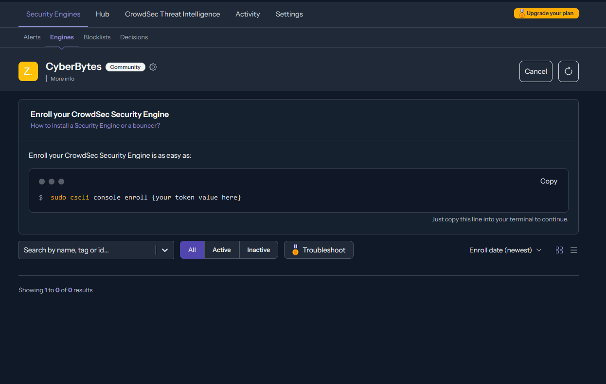
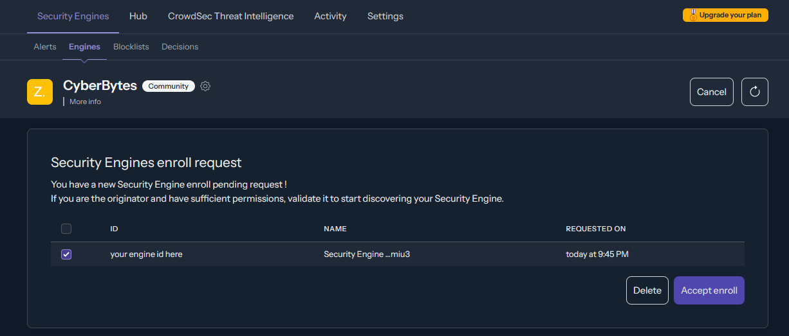
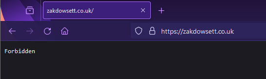

*We can use reverse proxies such as [Traefik](https://traefik.io/) to protect ourselves from public traffic accessing unwanted parts of our server, increasing security, performance, and reliability.  But how can we ensure that our incoming traffic isn't malicious?*

[CrowdSec](https://www.crowdsec.net/)  is a free, modern & collaborative behavior detection engine, offering more features than Fail2Ban, which protects against brute-force attempts. Crowdsec utilizes multiple open source data sources shared amongst its many users to protect against common IPs and CVEs (Common Vulnerability Exploits) and acts as a "bouncer" for common reverse proxies such as Traefik and Nginx, even Authlog to protect you against unwanted SSH attempts.

In this guide, I will be adding Crowdsec to my existing Traefik reverse proxy to parse incoming traffic before being redirected by my reverse proxy.

```yaml
version: "3"
services:
  # existing Traefik container
  traefik:
    image: traefik:v2.9
    container_name: traefik
    restart: unless-stopped
    ports:
      - 80:80
      - 443:443
    volumes:
      - /etc/acme:/etc/acme
      - /var/run/docker.sock:/var/run/docker.sock:ro
      - /etc/traefik:/etc/traefik
      - /var/log:/var/log
    labels:
      # these are the min traefik settings required to get crowdsec working
      <span style="color: red"># crowdsec parses the access log to look for any offending IPs</span>
      - accessLog=true
      - accessLog.filePath=/var/log/traefik/access.log
      - accessLog.bufferingSize=100 
      - accessLog.filters.statusCodes=204-299,400-499,500-59 
      - providers.docker=true
      - entrypoints.web.address=:80acme.json
      - entrypoints.http.http.middlewares=bouncer@docker
  
  # the actual crowdsec application
  crowdsec:
    image: crowdsecurity/crowdsec:latest
    container_name: crowdsec
    restart: unless-stopped
    depends_on:
      - traefik
    volumes:
      - /etc/crowdsec:/etc/crowdsec
      - /var/lib/crowdsec/data:/var/lib/crowdsec/data
      - /var/log:/var/log
    environment:
      COLLECTIONS: crowdsecurity/linux crowdsecurity/traefik
  
  # the bouncer which is polled by traefik
  bouncer:
    image: fbonalair/traefik-crowdsec-bouncer:latest
    container_name: bouncer
    restart: unless-stopped
    environment:
      CROWDSEC_BOUNCER_API_KEY: 
      CROWDSEC_AGENT_HOST: crowdsec:8080
    depends_on:
      - crowdsec
    # the labels tell traefik to make a middleware which calls the bouncer before routing to ensure that the traffic is genuine
    labels:
      - traefik.http.middlewares.bouncer.forwardauth.address=http://bouncer:8080/api/v1/forwardAuth
      - traefik.http.middlewares.bouncer.forwardauth.trustForwardHeader=true
      - traefik.http.services.bouncer.loadbalancer.server.port=8080
```


Above is a basic *docker-compose.yaml* file which contains the  3 docker images needed to set up crowdsec. The main crowdsec container does all the legwork and contains the decisions list and apis to poll the public blocklists and decide if an incoming IP is valid or not. The bouncer container is the middleware that traefik uses to communicate with crowdsec, all incoming traffic will go through the bouncer before being forwarded to the correct internal server.

Once the containers are up and running, we need  to connect the crowdsec container to the crowdsec API. To do this, you will need to navigate to [CrowdSec](https://www.crowdsec.net/?ref=blog.zakdowsett.co.uk) and create a free account. Then go to **Security Engines** under your profile and create a new engine. This will generate a token for you to easily register your crowdec container to their API:


*Get your new security engine token from the CrowdSec website*

The code can then be executed on the docker container like so:

```bash
sudo docker exec crowdsec cscli console enroll {your token value here}
```


Once that is done, go back to the CrowdSec website and confirm that you want to enroll the engine, and voila! Just like that, your CrowdSec engine is authenticated and can call the CrowdSec API. You can also view your statistics and alerts on the website at any time to see how many threats you have prevented.


*Confirm that you want to enroll your container with CrowdSec*

Now, we need to connect our bouncer to CrowdSec so that our reverse proxy can query the CrowdSec API. To do that, we need to generate a key to ensure that only the bouncer can query our CrowdSec container:

```bash
sudo docker exec crowdsec cscli bouncers add traefik-bouncer
```


Copy the key that is returned and add it into the environment variable *CROWDSEC_BOUNCER_API_KEY* that we left blank before in our compose file. Once this is done, restart your containers and everything is ready to go!

**Now lets test to see if everything works:**

To make sure everything works, we will add our public IP to our decisions list to ensure that any traffic from our address is blocked by Crowdsec, like so:

```bash
sudo docker exec crowdsec cscli decisions add --ip XXX.XX.XX.XXX
```

Then, navigating to one of our endpoints, it should return a 403 (Forbidden response) like so:


*Your website should now show a forbidden message*


Once we're happy that everything is set up and working, we can remove our IP from the decisions list so that we can access everything again:

```bash
sudo docker exec crowdsec cscli decisions delete --ip XXX.XX.XX.XXX
```

**A quick note:**

If you are using Traefik, you may find that Crowdsec is not listening for offending IPs in your access log. If this is the case, you will need to modify your *acquis.yaml* file, found under /etc/crowdsec and append the follwoing lines  to the bottom of the yaml so that CrowdSec knows where your Traefik access log is:

```yaml
---
filenames:
  - /var/log/traefik/access.log
labels:
  type: traefik
```