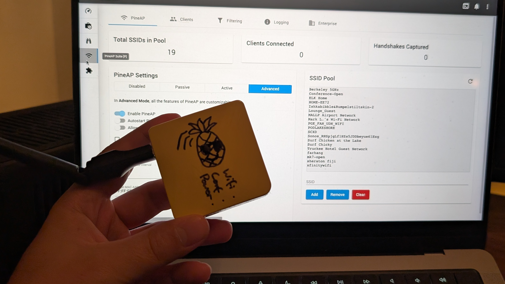
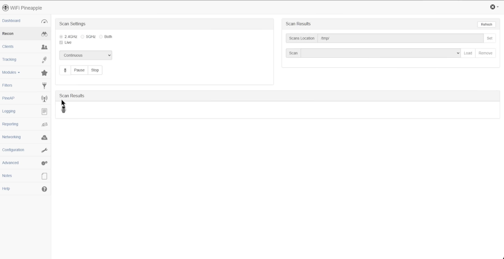

*The WiFi Pineapple, originally from [Hak5](https://hak5.org/), is an infamous WiFi Pen-testing tool which can perform a number of different functions such as recon and MitM attacks, allowing hackers (white-hat ofc) to find vulnerabilities in the network and strengthen their security*

The WiFi Pineapple has proven to be highly useful tool that should be in every hackers toolkit, becoming so infamous, it has made its way to the big screen and in series such as Mr. Robot. This popularity has made it hard to get, and when it is available, the price can be around £300! But it doesn't have to be this way; cheap, portable routers can be purchased and easily flashed with the Pineapple firmware, reducing the overall cost to less than £40!

Let's get building!

The below article is a step-by-step guide on how to create a DIY WiFi Pineapple, using the Pineapple Port created by [xchwarze on GitHub](https://github.com/xchwarze/wifi-pineapple-cloner).

## Step 1. Acquire Hardware

### [GL.iNet N300 Mini Wireless Router](https://www.gl-inet.com/products/gl-mt300n-v2/)

This powerful little mini router fits in the palm of your hand, consumes less than 3 watts of power, and is desgined with DIY projects in mind, making it the perfect device to run the Pineapple firmware on. This can be paired with a power bank, allowing it to run on the go, hiding inconspiculously in a backpack. 

### [RT5370 WiFi Adapter](https://www.ebay.co.uk/sch/i.html?_nkw=+RT5370+WIFI+adapter)

As the above router only contains one wireless adapter, we will need to purchase a second one, either a RT5370 or MT7612U adapter. I’m going with the former option, because it’s cheaper. It’s important to note that not all adapters are created equal! Other adapters may not work with OpenWRT firmware when it is flashed.

*Here’s the finished product (terrible drawings of a pineapple available on commission)*

## Step 2. Flash OpenWRT

Next, we need to flash OpenWRT onto the router, specifically version 19.07.7 to work with the Pineapple. When downloading, we must ensure that we have the correct firmware that will work with the hardware available on this device. For this specific router, we can find the right one [here](https://archive.openwrt.org/releases/19.07.7/targets/ramips/mt76x8/).

Once this is done, we need to boot the router into **recovery mode**. The instructions can be found in your specific manual, but can be done on this device by holding down on the reset button whilst plugging in the power.

Connect the devices LAN port to your computers ethernet port, ensuring that you are disconnected from any other network. Then visit the routers default gateway at `192.168.1.1`, and upload the firmware that was downloaded above. 

*Update OpenWRT to version 19.07.7*

## Step 3. Install the Pineapple Software

Now we have the correct version of OpenWRT installed, we need to grab the correct WiFi Pineapple build, which is conveniently [available on Gitlab here](https://gitlab.com/xchwarze/wifi-pineapple-cloner-builds/-/tree/main/releases?ref_type=heads). Download the correct image that relates to our device of choice and then navigate back to your default gateway.

Once inside the router, we need to navigate to `System > Backup / Flash Firmware` and upload the file to the router. This will take a while to install (about 5 minutes) and will signal completion on the device itself once all 3 LEDs on the front of the device light up and stay solid.

Now we can connect to the Pineapples interface at `http://172.16.42.1:1471/` and wait for the device to complete its first setup. Pay attention to the dialogs that appear on screen and plug in the external WiFi adapter when prompted, then hit the reset button, et voila! We are done!

## Step 4. Confirm Everything’s in Working Order

Let’s make sure everything is now working by running recon on the WiFi points around us. We can select **Recon** on the left hand side, then click **Start PineAP**. Once the pineapple starts transmitting, we know that everything has been installed and is functioning correctly.

*Recon is one of the many tools that the pineapple offers*